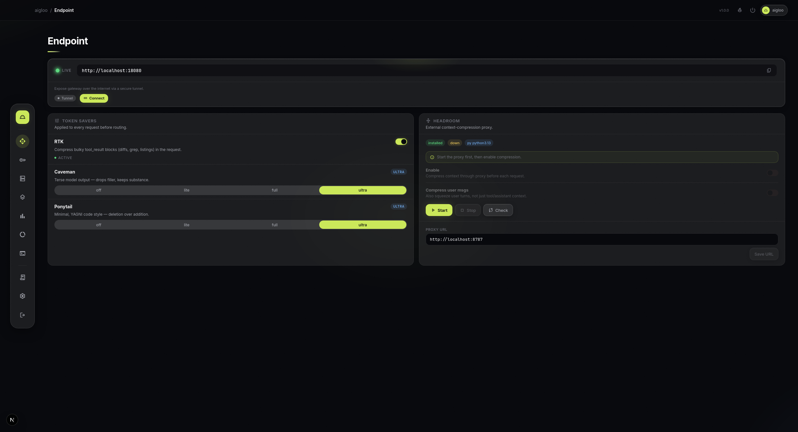
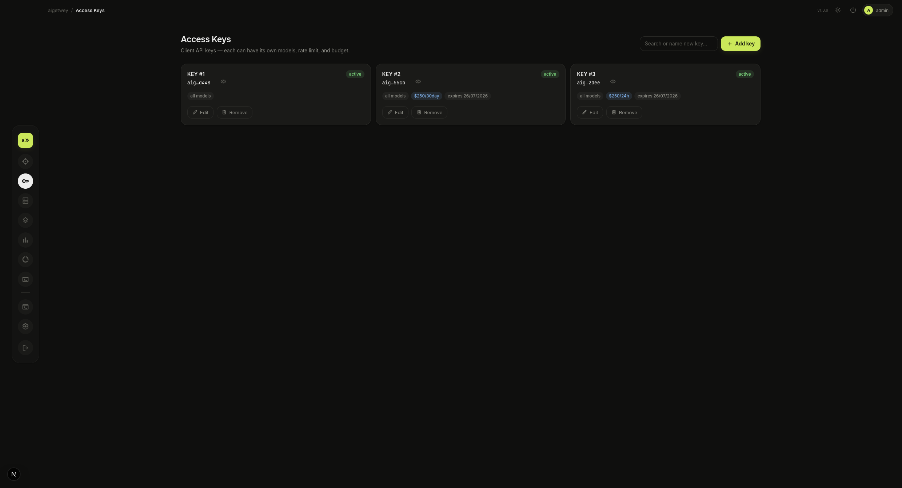
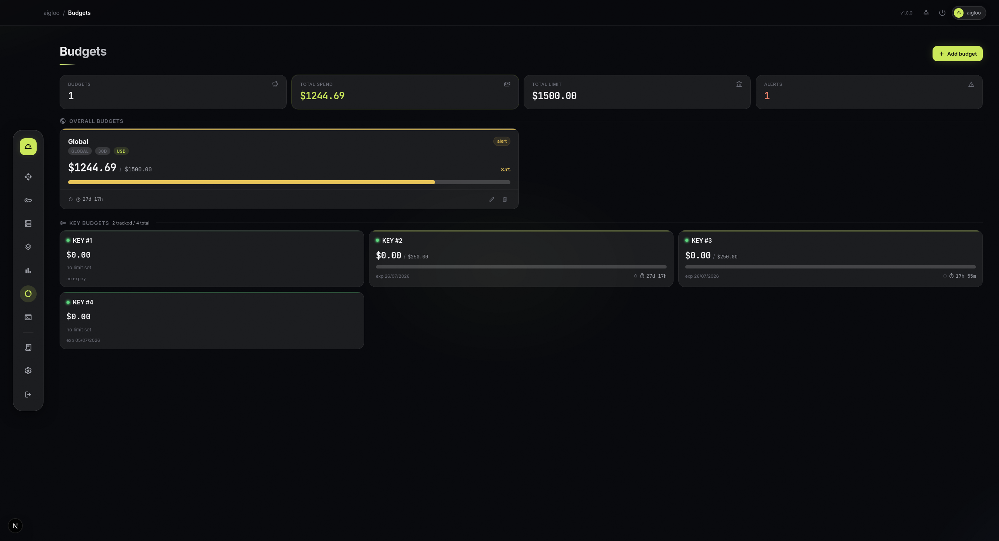

<p align="center">
  
</p>

<p align="center">
  <strong>Self-hosted AI gateway</strong><br>
  One endpoint · format translation · fallback routing · token saving · spend control · access keys
</p>

<p align="center">
  <a href="https://www.npmjs.com/package/aigloo"></a>
  <a href="https://www.npmjs.com/package/aigloo"></a>
  <a href="./LICENSE"></a>
  
</p>

<p align="center">
  <a href="#features">Features</a> · <a href="#getting-started">Quick Start</a> · <a href="#token-savers">Token Savers</a> · <a href="#configuration">Config</a> · <a href="#supported-cli-tools">CLI Tools</a>
</p>

---

## Why aigloo?

Every AI app speaks a different API format. Every provider has different keys, models, and rate limits. You juggle configs, hit quota walls mid-session, and lose track of spend.

**aigloo fixes this.** One local endpoint, one key. Point any app at it — Claude Code, opencode, Cursor, Codex, or anything that supports a custom base URL. It translates formats, routes across providers with automatic fallback, compresses token-heavy context, and tracks every cent.

```bash
npm install -g aigloo && aigloo
```

First run bootstraps everything. Subsequent runs start instantly.

---

## How it works

```
  Your tools              aigloo                      Providers
  ──────────        ────────────────────         ──────────────
  Claude Code  ──┐                           ┌──► Anthropic
  opencode     ──┤  format translation       ├──► OpenAI
  Cursor       ──┼─► routing & fallback ─────┼──► OpenRouter
  Codex        ──┤  token compression        ├──► Gemini
  any app*     ──┘  spend tracking            └──► Ollama / custom
                     ▲
                     │
                one endpoint
                one API key

  * any app that supports a custom base URL + API key
```

1. **Add providers** — paste your API keys, pick models. Use `provider/model` directly (key round-robin) or define combo aliases for multi-provider fallback chains
2. **Point your tools** at `http://localhost:18080` with a gateway key
3. **Track everything** — per-request cost, token usage, budgets, alerts

---

## Features

- **Format translation** — OpenAI ↔ Anthropic on the fly, streaming included
- **Routing & fallback** — use `provider/model` directly (key round-robin) or define combo aliases for multi-provider fallback chains; auto-rotates keys on 429/5xx/timeout
- **Token savers** — RTK compresses tool results, caveman trims prose, ponytail nudges minimal code, headroom compresses context
- **Access keys** — share gateway keys with model allowlist, rate limit, spend cap, and expiry
- **Budgets** — rolling spend caps (global/provider/model/key) with live countdown and per-token-type cost tracking
- **Alert notifications** — webhook, Telegram, or Discord alerts when budgets hit their threshold or run out. Deduped per budget window
- **Dashboard** — glassmorphic aigloo design: providers, combos, usage, budgets, CLI tools, live console, settings — all drag-to-reorder

<p align="center">
  
  <br><sub>Endpoint page — token saver toggles & endpoint config</sub>
</p>
<p align="center">
  
  <br><sub>Access Keys — model allowlist, rate limit, spend cap per key</sub>
</p>
<p align="center">
  
  <br><sub>Budgets — rolling spend caps with live countdown</sub>
</p>

---

## Getting started

### Quick start

```bash
npm install -g aigloo
aigloo
```

The CLI seeds `config.yaml`, builds the dashboard, opens your browser. One URL serves everything — dashboard, API, and admin: `http://localhost:18080`.

A terminal menu offers: **Web UI** / **Terminal** (logs) / **Hide to Tray** (macOS · Linux · Windows) / **Exit**.
Flags: `-p/--port`, `-n/--no-browser`, `-y/--yes`, `-t/--tray`.

### From source

```bash
git clone https://github.com/xk1ko/aigloo.git
cd aigloo && npm install
cp config.example.yaml config.yaml   # add providers + a server key
npm install --prefix dashboard
./run.sh                              # Ctrl-C stops both
```

### Connect your tools

```bash
# Claude Code (Anthropic format)
export ANTHROPIC_BASE_URL=http://localhost:18080
export ANTHROPIC_API_KEY=my-key

# opencode / Cursor / Cline / Codex (OpenAI format)
export OPENAI_BASE_URL=http://localhost:18080/v1
export OPENAI_API_KEY=my-key
```

The dashboard's **CLI Tools** page detects installed tools and writes configs for you.

**Model resolution** (in order): combo alias → `provider/model`.

Any app that supports a custom base URL + API key can use aigloo — just set the model to `provider/model`.

---

## Supported CLI tools

Claude Code · opencode · Cursor · Codex · Cline · Continue · Roo · Aider · Gemini CLI · Qwen Code · Kilo Code · Crush · Droid · Copilot

Any app that supports a custom base URL + API key works — just set the model to `provider/model`.

---

## Configuration

**Everything is configurable from the dashboard** — providers, combos, budgets, token savers, access keys, and settings. No need to edit files manually.

Under the hood, `config.yaml` is the source of truth and **hot-reloads** — any change made in the dashboard writes to this file instantly. You can also edit it by hand if you prefer; changes apply without restart.

<details>
<summary><strong>config.yaml reference (click to expand)</strong></summary>

```yaml
server:
  host: 0.0.0.0
  port: 18080
  api_keys: [my-key]        # empty = auth OFF (localhost only)

endpoint:
  rtk: true                 # compress tool_result blocks
  caveman: full             # off | lite | full | ultra
  ponytail: lite            # off | lite | full | ultra
  headroom: off             # off | on — requires external headroom proxy

providers:
  - id: anthropic
    format: anthropic
    base_url: https://api.anthropic.com/v1
    api_keys: [sk-ant-xxx]
  - id: opencode-free
    format: openai
    base_url: https://opencode.ai/zen/v1
    free: true
    # auto_models: false    # fetch provider's /v1/models catalog (manual)

models:
  - alias: claude-sonnet-4-6
    target: [anthropic, opencode-free]   # fallback order
    model: [claude-sonnet-4-6, claude-sonnet-4-5]
    price_in: 3             # USD per 1M tokens
    price_out: 15

budgets:
  - scope: { type: global }
    unit: usd
    limit: 50
    window: 30day
```

</details>

A **combo** is a `models` entry — an alias routed to a provider chain. Strategies: `fallback` (default, sequential) or `round-robin` (spread load).

---

## Token savers

| Saver | What it does | Source | Install |
|-------|-------------|--------|---------|
| **RTK** | Compresses bulky `tool_result` blocks (git/grep/ls) | [rtk-ai/rtk](https://github.com/rtk-ai/rtk) | built-in |
| **Caveman** | Terse system prompt — cuts output prose | [JuliusBrussee/caveman](https://github.com/JuliusBrussee/caveman) | built-in |
| **Ponytail** | Nudges minimal code (YAGNI, deletion) | [DietrichGebert/ponytail](https://github.com/DietrichGebert/ponytail) | built-in |
| **Headroom** | Pipes context through `/v1/compress` | [chopratejas/headroom](https://github.com/chopratejas/headroom) | **external** |

Headroom is the only external dependency — install from [chopratejas/headroom](https://github.com/chopratejas/headroom) (Python ≥ 3.10), run `headroom proxy`. Without it the toggle stays off; everything else works.

---

## Environment variables

| Variable | Purpose |
|----------|---------|
| `AIGLOO_CONFIG` | Config file path |
| `AIGLOO_DATA_DIR` | Usage DB directory |
| `AIGLOO_ADMIN_PASSWORD` | Admin password — seeds on first boot, then stored as scrypt hash in `auth.json`. Default `123456` |
| `AIGLOO_PORT` | Listen port (default 18080) |
| `SESSION_SECRET` | Dashboard session cookie signing key. Auto-generated and persisted if unset |

Admin password and provider keys never reach the browser — the dashboard proxies `/admin/*` server-side.

---

## Data location

| OS | Path |
|----|------|
| macOS / Linux | `~/.aigloo/` |
| Windows | `%APPDATA%\aigloo\` |

Contains `config.yaml` and `usage.sqlite`. Delete the folder to reset everything.

---

## Development

```bash
npm run typecheck       # tsc, no emit
npm test                # vitest (unit + synthetic E2E)
npm run build           # compile to dist/
```

---

## ⭐ Star this repo

If aigloo helps you, consider giving it a star — it helps others discover it.

---

## Acknowledgements

Inspired by [9router](https://github.com/decolua/9router) — its feature set and dashboard shaped much of this project's direction.

## License

[MIT](./LICENSE) © xk1ko

## Contributing

Issues and ideas welcome: <https://github.com/xk1ko/aigloo/issues>
